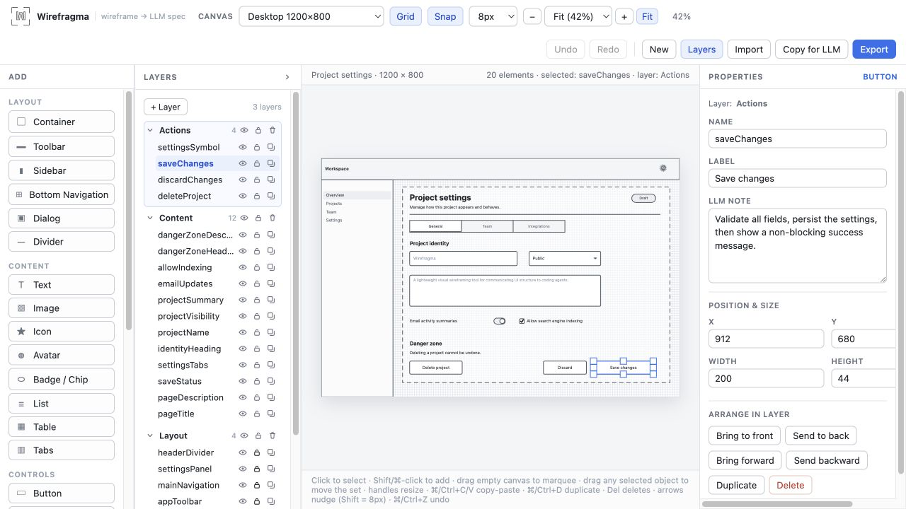
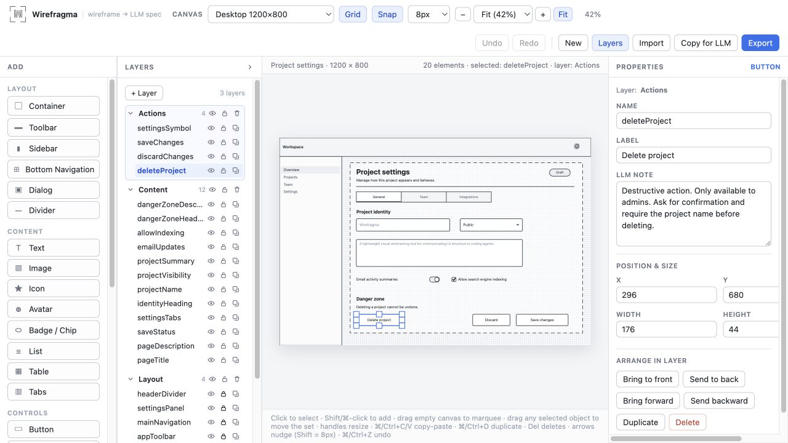
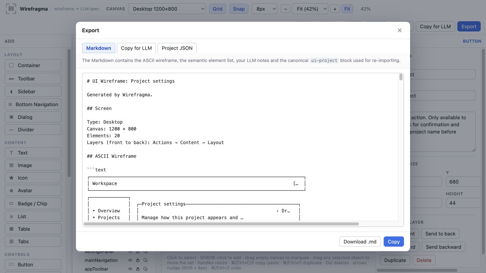

# Wirefragma

**A lightweight visual wireframing tool for communicating UI structure and behavior to LLMs.**

Wirefragma lets you sketch an interface, attach implementation intent to individual objects, and
export the result as an LLM-readable specification. Give that specification to ChatGPT, Claude,
Codex, DeepSeek, or another coding agent.

The editor itself does not call an AI API. It prepares portable context for whichever model or
agent you already use.



[**Project website**](https://smallhall.net/wirefragma/) ·
[Sample project](sample/WIREFRAGMA%20sample%20project.json) ·
[Documentation](docs/README.md) ·
[MIT License](LICENSE)

## The basic workflow

```text
Sketch visually
      ↓
Annotate behavior
      ↓
Export
      ↓
ASCII layout + semantic Markdown + canonical project source
      ↓
Give it to a coding agent
```

A Wirefragma document combines several views of the same interface:

- a quick visual wireframe for the human;
- semantic names, labels, bounds, layers, and content for the model;
- per-element **LLM notes** explaining behavior and constraints;
- an approximate ASCII representation of the layout;
- a lossless embedded project representation that can be imported back into the editor.

## Why I built this

I frequently use coding agents to implement interfaces, and I needed a very fast way to explain
UI composition to them. Sometimes the whole design brief is simply: put a sidebar here, a button
there, and make sure the button asks for confirmation before it deletes anything.

Figma is excellent at professional, high-fidelity design and collaborative production workflows.
That is more machinery than I need for this particular job. Text-first UI DSLs solve the
machine-readable side, but reverse the workflow: I do not want to describe an interface in text
before I can see it.

I wanted **visual sketching for the human → structured specification for the LLM**. That became
Wirefragma. The project itself was also built heavily through LLM-assisted development.

The canvas architecture grew from interaction patterns already proven in my NEVERCAT web level
editor: one canonical model, one geometry system, one coordinate transform, deterministic hit
testing, and explicit Canvas 2D interactions instead of delegating editor semantics to a scene
graph.

> Wirefragma is not trying to replace Figma. It deliberately stops much earlier.

Its job is rough structural thinking with very little setup: arrange generic UI primitives, make
their intent explicit, and hand the result to a coding agent in a form it can read directly.

## LLM notes are part of the wireframe

A label describes what the user sees. An LLM note can describe everything the coding agent needs
to know but cannot infer from the rectangle:

```text
Delete project

LLM note:
Destructive action. Only available to admins.
Ask for confirmation and require the project name before deleting.
```



Notes are exported beside the element's type, layer, label, bounds, visible content, and relevant
typography. They are also preserved in the canonical project source.

## What the LLM receives

One Markdown export contains complementary representations of the project.

### ASCII layout

The ASCII sketch gives a model a rough spatial reading of the screen. It is useful context, not a
pixel-perfect renderer.

### Semantic UI specification

Each visible element gets a readable section with its semantic name, type, layer, bounds, label,
content, styling where applicable, and LLM note.

### Spatial summary

A deterministic summary describes important regions and structural relationships in prose.

### Embedded project source

A fenced `ui-project` JSON block contains the complete editable project. Wirefragma reads this
block when importing the Markdown again.

Here is a small, representative excerpt:

````markdown
## ASCII Wireframe

```text
┌──────────────┐  ┌──────────────────────────────────────┐
│ • Overview   │  │ Project settings                     │
│ • Projects   │  │ [ Wirefragma ]  [ Public ▾ ]         │
│ • Settings   │  │                  [ Save changes ]     │
└──────────────┘  └──────────────────────────────────────┘
```

### `saveChanges`

Type: Button

Layer: Actions

Label: Save changes

Bounds: x=912, y=680, width=200, height=44

LLM note:

Validate all fields, persist the settings, then show a non-blocking success message.

## Editable Project Source

```ui-project
{
  "version": 2,
  "title": "Project settings",
  "canvas": { "mode": "desktop", "width": 1200, "height": 800 },
  "layers": ["..."],
  "elements": ["..."]
}
```
````

**The ASCII drawing is approximate. The embedded `ui-project` source is canonical.** Import never
tries to reconstruct geometry from ASCII.



## What the editor can do today

### Canvas and editing

- desktop, portrait-mobile, landscape-mobile, and custom canvas sizes;
- configurable grid and snapping;
- fit-to-window, preset zoom levels, buttons, shortcuts, and trackpad zoom;
- drag and resize with deterministic hit testing;
- multi-selection with Shift/Cmd-click and marquee selection;
- rigid multi-object movement that preserves relative positions;
- duplicate, internal copy/paste, delete, arrow-key nudging, undo, and redo.

### Layers

- layers with visibility and locking;
- Unity-style nesting: drop an element onto another in the Layers tree to put it inside (children
  always draw in front of their parent and move, hide, lock, copy and delete with it);
- per-element visibility and locking;
- layer and object reordering;
- moving elements between layers;
- front/back arrangement controls.

### Generic wireframe elements

The palette includes containers, toolbars, sidebars, dialogs, bottom navigation, text, images,
icons, avatars, lists, tables, tabs, buttons, icon buttons, inputs, textareas, dropdowns,
checkboxes, radio controls, toggles, sliders, progress indicators, and badges/chips — plus two
scene elements: a **Canvas** for small structured diagrams (shapes, arrows, curves, labels, exported
as an ASCII sketch, a primitive list and relationships) and a **Drawing** for freehand sketches
described in words. Double-click either one (or use its hover pencil) to edit it in a popup.

These are deliberately generic wireframe primitives rather than native platform widgets.
Specialized patterns such as a search field or date picker can be expressed with a primitive plus
an LLM note.

### Text and symbols

- basic text size, weight, italic, underline, and alignment controls;
- emoji/symbol picker for Icon and Image elements;
- configurable symbol content size;
- Unicode-safe label fitting.

### Languages and themes

- UI in English (default), Russian, German, French, Spanish, Serbian, Japanese and Simplified
  Chinese; light, dark or system theme. Guests switch in the Properties panel, signed-in users in
  their account settings. The Markdown export always stays English.

### Accounts and projects (optional)

- sign-up with captcha, email confirmation and privacy-policy consent; sign-in, password reset,
  account deletion — or continue without an account;
- a collapsible projects panel (Codex / Claude Code style): projects with wireframes, instant
  switching with per-wireframe undo history, autosave to MySQL with conflict detection;
- Import moves to the projects panel and adds the import as a new wireframe;
- plain PHP + MySQL, deployable on ordinary shared hosting such as Namecheap.

### MCP for coding agents (optional)

Signed-in projects can be opened by coding agents (Claude Code, Codex, Cursor, …) through a remote
[MCP](https://modelcontextprotocol.io) endpoint at `https://<your host>/mcp/`:

- create a personal access token in **Settings → MCP access** (read / create and edit / delete
  permissions, expiry, revocable at any time) and add the endpoint to your client with
  `Authorization: Bearer <token>`;
- the agent lists projects, reads a wireframe's canonical JSON, creates wireframes and saves
  changes with revision checks — it can never silently overwrite your newer edits;
- a wireframe open in the browser picks up the agent's changes within seconds.

The agent is the LLM; Wirefragma still makes no AI calls. Details: [docs/mcp.md](docs/mcp.md).

### Import and export

- export regular Markdown or an LLM-prefaced variant;
- copy LLM-ready Markdown directly to the clipboard;
- download the canonical project as JSON, or a whole project with all its wireframes as a
  `.wfproj` file (import it back as a project, or pick one wireframe out of it);
- export a single layer (Layers → "…" → Export layer), optionally cropped to its content — handy
  for explaining one form to a model;
- export the **WIREFRAGMA schema**: LLM-ready instructions for the project JSON, so a chat model
  can generate a wireframe that you paste back into Import;
- import raw project JSON, Markdown containing a `ui-project` block, or an LLM answer with the
  JSON inside a code block;
- lossless round trips for project fields, including hidden layers and elements.

## Try the sample project

The repository includes a real mobile project at
[`sample/WIREFRAGMA sample project.json`](sample/WIREFRAGMA%20sample%20project.json). It contains a
metrics screen and a hidden confirmation layer, so it is a quick way to inspect content,
typography, symbols, layers, locking, visibility, and LLM notes without starting from an empty
canvas.

To open it:

1. Start Wirefragma.
2. Click **Import**.
3. Choose the sample JSON file.

Import replaces the current document and starts a fresh undo history, so export anything you want
to keep first.

## Run locally

Requirements: a current Node.js installation and npm.

```bash
npm install
npm run dev
```

Open the local URL printed by Vite. No environment variables, backend, account, or AI API key are
required.

Optional accounts backend (sign-in, projects panel, MySQL storage): create a MySQL/MariaDB
database, import `server/schema.sql`, copy `server/api/config.sample.php` to
`server/api/config.php` (use `'transport' => 'log'` for mail), then run `npm run dev:api` next to
`npm run dev` — Vite proxies `/api` (and `/mcp`) to PHP's built-in server. See
[docs/accounts.md](docs/accounts.md); deployment to Namecheap / cPanel shared hosting is described in
[docs/deployment.md](docs/deployment.md). The MCP endpoint additionally needs Composer and PHP 8.1+
(`npm run mcp:install`; see [docs/mcp.md](docs/mcp.md)).

Useful commands:

```bash
npm test          # Vitest unit tests
npm run build     # typecheck + production build into dist/
npm run build:deploy  # the same + the MCP endpoint in dist/mcp (needs Composer)
npm run preview   # serve the static production build locally
```

The production output uses relative asset paths and can be hosted as ordinary static files.

## Architecture

Wirefragma is a React application shell around a hand-written Canvas 2D editor. The explicit
engine is intentional: drawing and hit testing share one geometry derivation, and pointer
gestures commit exactly once when they finish.

```text
React application shell
        ↓
Wireframe project model
        ↓
canonical geometry + coordinate transform
        ↓
Canvas 2D renderer + hit testing + interaction engine

project model
   ├── localStorage autosave (guest) / optional PHP + MySQL API (signed in)
   │                                     └── same storage over MCP for coding agents
   ├── ASCII renderer + spatial summary
   └── Markdown / JSON / ui-project export
```

The short version is: React owns document and view state; `src/canvas/` owns geometry, rendering,
hit testing, and pointer gestures; pure model and serialization code stay independent of the DOM.

Read [the architecture documentation](docs/architecture.md) for the dependency rules and the
reasoning behind the engine. Canvas changes should also start with
[canvas-engine.md](docs/canvas-engine.md) and [interactions.md](docs/interactions.md).

## Data and privacy

Wirefragma is a client-side web application:

- without an account, the current project autosaves to the browser's `localStorage`;
- storage is specific to the browser, origin, scheme, and port;
- no backend or account is required by the editor; a deployment *may* add the optional accounts
  backend, in which case signed-in projects are stored in that server's database (with a sign-up
  captcha, email confirmation and a privacy policy) and anyone can still continue without an
  account;
- the app makes no LLM call itself; with the optional MCP endpoint, external agents you authorize
  with a personal token can read and edit your signed-in projects;
- Markdown and JSON exports are explicit, portable files you control.

This architecture keeps the editor simple, but browser storage is not a project library or a
backup. Export important work before clearing site data or moving between deployments.

## Current scope

Without an account, Wirefragma supports one canvas and one autosaved project slot; with the
optional accounts backend, projects hold any number of wireframes. Layers are a flat list (elements can nest inside elements). There
is no rotation, grouping, group resize, alignment system, auto-layout, asset pipeline,
collaboration, or built-in AI. Multi-selection can move a set but cannot resize it as a group.

Those boundaries are part of the product's current focus, not hidden promises. See
[known limitations](docs/known-limitations.md) for the exact behavior.

## Documentation

User-facing documentation (editor guide, export format, accounts, MCP setup and tool reference,
self-hosting) is published with the app at `/docs/` — sources in [`public/docs/`](public/docs/).

[`docs/`](docs/README.md) is the comprehensive technical documentation set. It covers the data
model, canvas engine, interaction rules, layers, history, clipboard, typography, symbols,
persistence, migrations, import/export format, accounts, MCP, testing, deployment, and current
limitations.

The documentation is deliberately written for both human contributors and coding agents. Start
with [docs/README.md](docs/README.md), then follow its task-specific reading map.

## Contributing

Wirefragma is intentionally small, but the canvas has a few important invariants. Before making
changes, read:

- [AGENTS.md](AGENTS.md);
- [docs/agent-guide.md](docs/agent-guide.md);
- [docs/canvas-engine.md](docs/canvas-engine.md) and
  [docs/interactions.md](docs/interactions.md) for canvas work;
- [docs/import-export.md](docs/import-export.md) and
  [docs/markdown-format.md](docs/markdown-format.md) for format changes.

Before opening a contribution, run:

```bash
npm test
npm run build
```

## License

Wirefragma is available under the [MIT License](LICENSE).

Copyright © 2026 [Andrey Makeev](https://smallhall.net).
