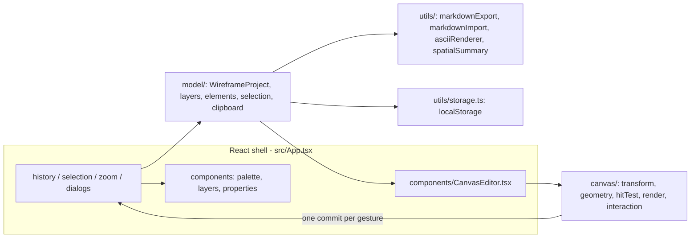

# Wirefragma — documentation for coding agents

This folder is the entry point for anyone (human or LLM) who has to change Wirefragma without
reading the whole repository first. Everything here describes the **current implementation**,
verified against `src/` — not a plan.

## What Wirefragma is

Wirefragma is a small, client-side **visual wireframe editor** whose only real output is an
**LLM-readable Markdown document**. A user draws a desktop / portrait-mobile / landscape-mobile
screen from a fixed palette of generic wireframe primitives, annotates each object with an
LLM note, and exports Markdown containing:

1. an approximate **ASCII sketch** of the screen,
2. a **semantic element list** (type, layer, label, bounds, content, notes),
3. a rule-based **spatial summary**,
4. the **canonical embedded project JSON** (`ui-project` fence) used for re-import.

That Markdown can be pasted back into the editor to reconstruct the editable project losslessly.
There is no backend, no account, no AI call and no network traffic.

Product philosophy: *simple wireframing plus an LLM-readable export*, explicitly **not** a Figma
clone. See [agent-guide.md](./agent-guide.md) before adding features.

## Stack

| Concern | Choice |
| --- | --- |
| Language | TypeScript 5.6, `strict`, `noUnusedLocals`, `noUnusedParameters` |
| UI shell | React 18 (`react`, `react-dom` only — no component library) |
| Build | Vite 5 (`base: "./"`, static output in `dist/`) |
| Tests | Vitest 2 (`environment: "node"`, `globals: true`, `src/**/*.test.ts`) |
| Rendering | Canvas 2D + Pointer Events, hand-written engine in `src/canvas/` |
| Persistence | `localStorage` (one autosaved slot), plus `.md` / `.json` downloads |

No Konva, no react-konva, no Fabric, no state-management library, no CSS framework, no backend.
`package.json` has exactly two runtime dependencies.

## Repository map

```text
index.html            single page; mounts #root and loads src/main.tsx
public/               static assets copied verbatim (wf_logo_w_white.png = header logo)
src/main.tsx          React root; in DEV also boots the ?selftest=N harness
src/App.tsx           application shell: document state, selection, shortcuts, dialogs
src/styles.css        all styling (panels, canvas, modals, emoji picker)
src/model/            canonical data model + pure transforms (no DOM, no canvas)
src/canvas/           transform -> geometry -> hitTest -> render + interaction engine
src/components/       React presentational components and panels
src/utils/            markdown export/import, ASCII renderer, spatial summary, history,
                      storage, zoom math, keyboard helper, clipboard helper
src/dev/selfTest.ts   development-only browser harness (?selftest=N), excluded from prod
```

Rough size for orientation (non-test source, ~10.7k lines total; tests add ~4.0k): `components`
~1.9k, `dev` ~1.9k, `model` ~1.8k, `canvas` ~1.6k, `utils` ~1.4k, root `App.tsx` + helpers ~1.0k.

## High-level architecture



In one sentence: **React owns the document and the view state; `src/canvas/` owns geometry, hit
testing, rendering and pointer gestures; the two meet through a very small callback surface
(`select`, `beginEdit` / `endEdit`, `commitMove`, `commitResize`, `requestRender`).**

## Documentation map

| Document | Read it when you need… |
| --- | --- |
| [architecture.md](./architecture.md) | the layering, the dependency rules, why the engine looks like this |
| [data-model.md](./data-model.md) | `WireframeProject` / `WireframeLayer` / `WireframeElement` fields and semantics |
| [canvas-engine.md](./canvas-engine.md) | coordinates, DPR, zoom, the geometry -> hit-test -> render pipeline |
| [interactions.md](./interactions.md) | every gesture, selection rule, snapping and the pointer lifecycle |
| [layers-and-z-order.md](./layers-and-z-order.md) | front/back conventions, draw order, hit order, visibility, locking |
| [history-and-clipboard.md](./history-and-clipboard.md) | undo/redo, transactions, duplicate, copy/paste |
| [typography-and-symbols.md](./typography-and-symbols.md) | `textStyle`, `contentSize`, the emoji picker, icon/image rendering |
| [import-export.md](./import-export.md) | export/import flows, validation, error behaviour |
| [markdown-format.md](./markdown-format.md) | the exact Markdown format and the `ui-project` block |
| [ascii-renderer.md](./ascii-renderer.md) | how the ASCII sketch is produced and why it is approximate |
| [persistence-and-migrations.md](./persistence-and-migrations.md) | storage keys, autosave, legacy migration, corrupt data |
| [testing.md](./testing.md) | test strategy, commands, the browser self-test harness |
| [deployment.md](./deployment.md) | static build, hosting, storage behaviour per origin |
| [agent-guide.md](./agent-guide.md) | the invariants and rules a coding agent must not break |
| [known-limitations.md](./known-limitations.md) | what Wirefragma deliberately does not do |

## Canonical terminology

Use these words in code, comments, commits and docs.

| Term | Meaning |
| --- | --- |
| project / document | the serializable `WireframeProject` — the only thing saved or exported |
| element | one `WireframeElement` (a button, a container, …) |
| layer | a `WireframeLayer`: grouping + stacking + visibility/locking, not a separate canvas |
| world / logical coordinates | project units stored in `element.x/y/width/height` (Y-down) |
| screen / CSS coordinates | CSS pixels inside the `<canvas>` element, after the view transform |
| device coordinates | screen × `devicePixelRatio`, the canvas backing store |
| view transform | `ViewTransform { scale, originX, originY }` — the only world<->screen mapping |
| geometry | `ElementGeometry`: bounds + semantic hit regions + resize handles for one element |
| hit region | a `Rect` in world space that a pointer may select (semantic, not always the bounds) |
| editor state | selection, hover, marquee preview, zoom, grid, active layer — never serialized |
| transient preview | mid-gesture geometry drawn instead of the committed document |
| commit | one finished gesture applied to the document (exactly one history entry) |

## Recommended reading order for a coding agent

1. [agent-guide.md](./agent-guide.md) — the rules; read before touching anything.
2. [architecture.md](./architecture.md) — where code lives and which layer may depend on which.
3. [data-model.md](./data-model.md) — the shape of the data you will edit.
4. The focused document for the task: canvas work ->
   [canvas-engine.md](./canvas-engine.md) + [interactions.md](./interactions.md); export work ->
   [markdown-format.md](./markdown-format.md); panel work ->
   [typography-and-symbols.md](./typography-and-symbols.md).
5. The actual source files those documents name, **before** editing.
6. [testing.md](./testing.md) — pick the focused test file and run it.

## Quick commands

```bash
npm install
npm run dev                                  # Vite dev server; ?selftest=10 runs the browser harness
npm test                                     # all unit tests (Vitest, node environment)
npx vitest run src/canvas/hitTest.test.ts    # one focused file
npm run build                                # tsc --noEmit + vite build -> dist/
npm run preview                              # serve the built app
```

## Conventions used in this documentation

* paths are relative to the repository root;
* `Invariant:` marks a rule future changes must preserve;
* code snippets come from the current source, trimmed for readability;
* where the top-level `README.md` and the code disagree, the code wins and the discrepancy is
  flagged in the relevant document (see [known-limitations.md](./known-limitations.md)).
